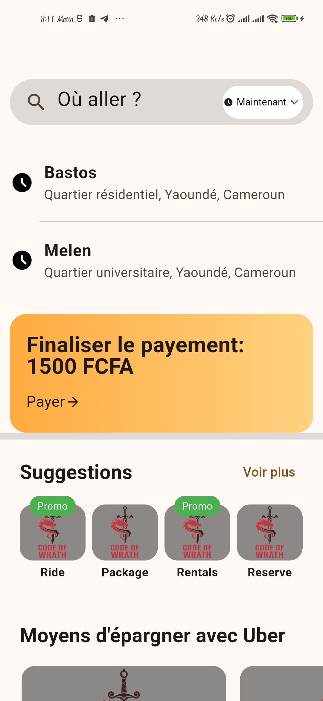
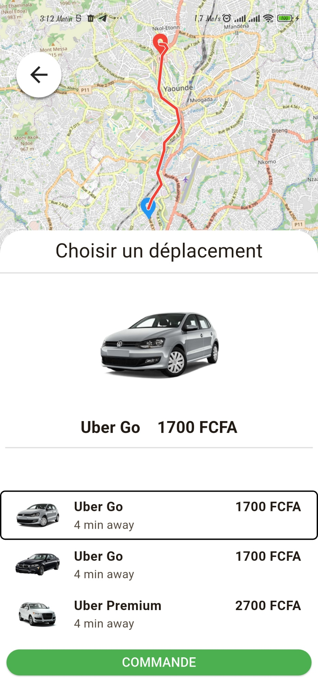

# 🚗 Uber UI Clone
Une réplique de l'interface utilisateur d'Uber développée avec Flutter. Ce projet démontre la recréation d'une application de covoiturage moderne avec une interface utilisateur fluide et intuitive.

### ✨ Fonctionnalités

- 🎨 Interface utilisateur moderne et épurée
- 📍 Interface de sélection de destination
- 🗺️ Intégration de carte interactive

### 🛠️ Technologies Utilisées

- **Flutter** - Framework de développement cross-platform
- **Dart** - Langage de programmation
- **Material Design** - Principes de design UI/UX

### 📋 Prérequis
Avant de commencer, assurez-vous d'avoir installé :

- Flutter SDK (version 3.0 ou supérieure)
- Dart SDK (version 2.17 ou supérieure)
- Android Studio / VS Code avec les extensions Flutter et Dart
- Un émulateur Android ou iOS (ou un appareil physique)

### 🚀 Installation


### 1. Cloner le dépôt

```
git clone https://github.com/CodeOfWrath/uber-ui-clone.git
cd uber-ui-clone
```

### 2. Installer les dépendances
```
bash   flutter pub get
```

### 3. Vérifier la configuration Flutter
```
bash   flutter doctor
```

### 4. Lancer l'application
```
bash   flutter run
```

### 📂 Structure du Projet
uber-ui-clone/\
├── android/             # Configuration Android\
├── ios/                     # Configuration iOS\
├── lib/                     # Code source principal\
│   ├── main.dart      # Point d'entrée de l'application\
│   ├── Pages/          # Écrans de l'application\
│   └── widgets/       # Widgets réutilisables\
├── assets/               # Images, icônes et ressources\
├── test/                   # Tests unitaires et d'intégration\
├── pubspec.yaml    # Dépendances du projet\
└── README.md      # Documentation


### 🎯 Fonctionnalités Implémentées
### Écrans Principaux

- Écran d'accueil avec recap
- Sélection de destination
- Estimation du trajet

### Composants UI

- Barre de recherche personnalisée
- Carte interactive
- Boutons d'action flottants

### 📸 Captures d'Écran

<div align="center">
  <table>
    <tr>
      <td align="center"><b>Écran d'accueil</b></td>
      <td align="center"><b>Sélection de destination</b></td>
      <td align="center"><b>Map interactive</b></td>
    </tr>
    <tr>
      <td></td>
      <td></td>
      <td></td>
    </tr>
  </table>
</div>

### 👨‍💻 Auteur
### CodeOfWrath

- GitHub: [@CodeOfWrath](https://github.com/CodeOfWrath)
- Projet: [uber-ui-clone](https://github.com/CodeOfWrath/uber-ui-clone)

### ⭐ Si ce projet vous a aidé, n'oubliez pas de lui donner une étoile !